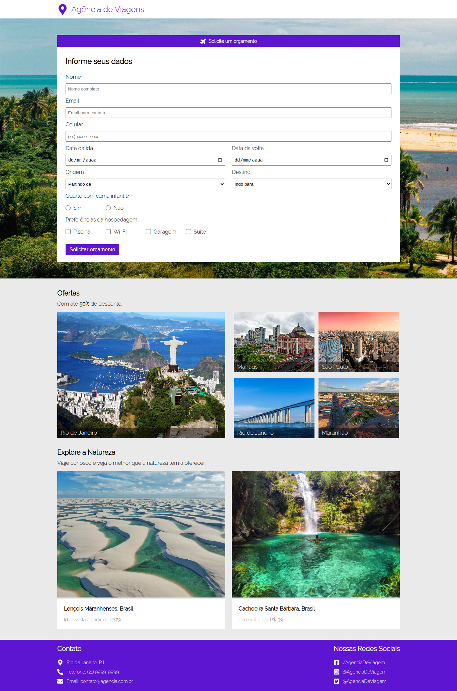

<h1 align="center"> Agência de Viagens </h1>

 

  <a href="#-tecnologias">Tecnologias</a>&nbsp;&nbsp;&nbsp;|&nbsp;&nbsp;&nbsp;
  <a href="#-projeto">Projeto</a>

 

  

## 🚀 Tecnologias

Esse projeto foi desenvolvido com as seguintes tecnologias:

- Html e CSS
- Git e Github

## 💻 Projeto

Este é o projeto do site de uma agência de viagens, onde o usuário cadastra seus dados e envia-os para um back-end que retornará esses dados.

- [Acesse o projeto finalizado, online](https://agencia-de-viagens-taupe.vercel.app/)
